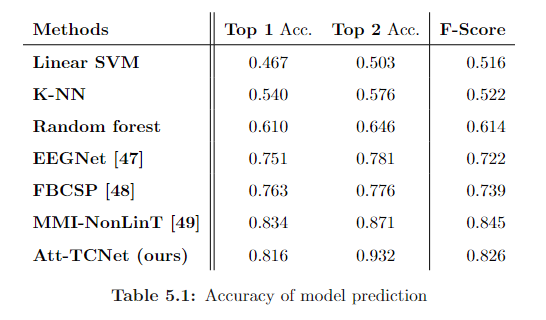

# Using a Brain-Computer Interface with a Human Support Robot for Object Grasping

## Methodology

### Data Pre-processing

In the data preprocessing stage, we perform two key operations to improve the quality and consistency of the dataset. Firstly, for different electrode signals in different EEG datasets, only the data of 14 key electrode positions corresponding to Epoc+ helmet were selected in this study: Af3 "and" F7 ", "F3", "Fc5", "T7 has", "what", "O1", "O2" and "P8", "T8", "Fc6", "F4", "F8", and "Af4", and to integrate these data for a large-scale labeled data set, for further analysis.

#### Data normalization

Secondly, to ensure unity across datasets, the min-max normalization method is used to standardize the feature data, and each feature value is scaled to the range of 0 to 1, which is calculated by the following formula:

We use the following formula for data normalization:

#### Position encoding

We use the following formula to define a unique label for each electrode:

For the case where dimension i is even, we use the sin function:

For the case where dimension i is odd, we use the cos function:

The final electrode arrangement selected is as follows:

### Spatial-Temporal Attention Block

This is one of the main contributions of this paper, We propose an EEG-based control method that utilizes an innovative attention-based encoder/decoder TCNet framework for  parsing information features within users' brainwaves. These parsed features are then employed through an enhanced  classifier to achieve precise control over robotic actions. The integration of an attention mechanism enables our method  to automatically identify the most discriminative features for control,  thus ensuring good performance also across a variety of datasets and collection environments.

#### Temporal Attention

The formula for the Temporal Attention module is as follows:

#### Spatial Attention

The formula for the Spatial Attention module is as follows:

### TCNet Block

In this paper, we use Temporal Convolutional Networks (TCN) to aggregate temporal information.

Based on the dilated convolution framework, this paper also uses residual connections to transfer information from the previous layer to the next layer. The operation of each layer can be described as follows:

### Loss Function

We adopted the cross-entropy loss function as the final loss function:

 To further enhance the quality of our predictions, we employ an additional smoothing loss to mitigate such over-segmentation
errors. In this context, the following loss function is used as the smoothing loss.

The resulting loss function is expressed as the combination of the two:

## Dataset and Equipment

#### EPOC X

The Epoc X headset, an advanced wireless EEG interface specifically designed to capture research-level EEG data, was used as the experimental device in this paper.

#### Tiago Robot

In our research, the TIAGO robot by PAL Robotics played an integral role as the primary experimental apparatus, tasked with the execution of motive actions derived from EEG signals.

#### Dataset

EEG Motor Movement/Imagery Dataset: This dataset consists of more than 1500 electroencephalogram (EEG) recordings of between one and two minutes in duration from 109 volunteers, captured using the BCI2000 system. The recordings included a variety of motor/imagery tasks that performed and imagined the opening and closing of the hand, fist, and foot movements. Baseline states were also recorded when the participant opened and closed his eyes. The dataset was provided by the BCI R&D Program team at the Wadsworth Center of the New York State Department of Health with a grant from the National Institutes of Health/National Institute of Biomedical Imaging and Bioengineering.

Grasp and Lift EEG Challenge: The dataset consists of EEG recordings from 12 subjects while performing six specific grasping and lifting movements subdivided into hand onset movement, first touch, two-hand onset loading phase, lifting, replacement, and two-hand release. Subjects also performed a multi-directional arm extension task in six different spatial directions: front, back, left, right, up, and down, 50 times in each direction, for a total of 300 actual motion data. For the motor imagery (MI) task, subjects were asked to imagine performing the same action, ensuring that the actual action was consistent with the number of trials of the imagined task. In addition, data containing three grasps of everyday objects and two wrist-twisting movements were also collected, each with 50 movements, providing 150 grasps and 100 wrist-twisting movements for each subject.

## Experimental procedures

The experiment consisted of four parts. First, we used the EPOC X helmet to collect electroencephalogram (EEG) signals from the participant. Next, we preprocessed the collected EEG signals. Then, we used Attention-based TCNet to analyze the processed EEG signals. Finally, based on the analyzed data, we used ROS to control the robot arm to grasp the object. The diagram of the experimental process is shown below:

## Experimental result:

#### Data processing:

The final processed data is shown in the figure:

#### Experimental scene:

## Evaluation

#### Accuracy of model prediction:

Top accuracy rate is selected as one of the evaluation indicators because it determines the final effect of the experiment. Since the model needs to predict two tasks (left hand or right hand, and the final action), the accuracy rate of the prediction with the highest possibility and the top two possibilities are selected as the final evaluation criteria.

 For K-fold cross-verification, K=4 is selected as the final evaluation criterion, and the final top accuracy is the average of the four training sessions.

Based on the recall rate, F-score, as a three-level indicator, is defined as:

Accuracy of model prediction:

#### Ablation experiments:

